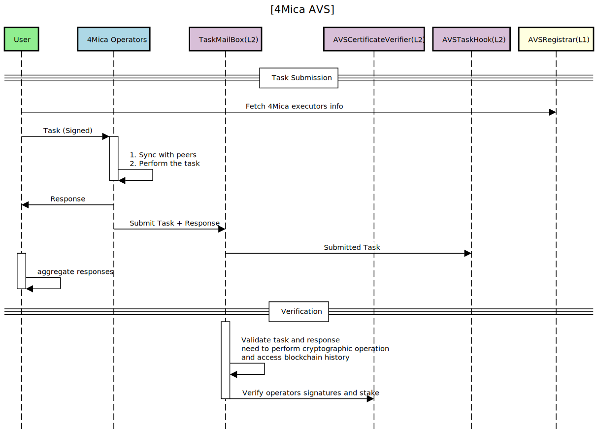

# 4mica Core AVS
[Not Audited, Testnet release]
EigenLayer AVS components for the 4mica network, powered by the [Hourglass framework](https://github.com/Layr-Labs/hourglass-monorepo) and the [EigenLayer DevKit CLI](https://github.com/Layr-Labs/devkit-cli/). The repository bundles performer logic, Hourglass aggregator/executor scaffolding, smart contract integrations, and release automation.

**Quick links**
- Official docs: [docs.4mica.network](https://docs.4mica.network)
- Hourglass framework: [github.com/Layr-Labs/hourglass-monorepo](https://github.com/Layr-Labs/hourglass-monorepo)
- EigenLayer DevKit CLI: [github.com/Layr-Labs/devkit-cli](https://github.com/Layr-Labs/devkit-cli)

## Table of Contents
- [Architecture](#architecture)
- [Repository Layout](#repository-layout)
- [Prerequisites](#prerequisites)
- [Setup](#setup)
- [Local Development](#local-development)
- [Configuration](#configuration)
- [Testing](#testing)
- [Building & Releasing](#building--releasing)
- [Troubleshooting](#troubleshooting)
- [Further Reading](#further-reading)

## Architecture



The diagram shows how tasks flow between clients, Hourglass services, performer nodes, and EigenLayer verification:
- Clients submit signed tasks that are batched by the Hourglass Aggregator.
- Performer nodes fetch assignments, execute task logic, and emit signed responses.
- Aggregated responses and certificates are validated against EigenLayer staking state before they are returned to clients or forwarded on-chain.

## Repository Layout
- `cmd/` – Go entry-points for performer binaries.
- `contracts/` – Solidity contracts bundled and built alongside the performer.
- `.hourglass/config/` – Aggregator, executor, and network configuration consumed by Hourglass.
- `.devkit/scripts/` – DevKit wrappers for building, releasing, and helper utilities.
- `config/` – Performer runtime configuration (keys, endpoints, tuning options).
- `docs/` – Project documentation and diagrams.
- `Makefile` – Common developer commands for building and testing.

## Prerequisites
- `go` ≥ 1.23.6 for compiling performer services.
- [`devkit`](https://github.com/Layr-Labs/devkit-cli) ≥ v0.2 for AVS scaffolding and DevNet orchestration.
- [`foundry`](https://book.getfoundry.sh/getting-started/installation) (`forge`) for contract builds/tests.
- `docker` for container builds and running the DevNet.
- `make`, `jq`, `yq`, and `git` available in your `$PATH`.
- Access to an EigenLayer operator keypair (see `keystores/`) for signing during local runs.

## Setup
1. Install the [EigenLayer DevKit CLI](https://github.com/Layr-Labs/devkit-cli) and ensure `devkit` is in your shell.
2. Install Go, Docker, and Foundry (`foundryup`) following their official instructions.
3. Copy or generate the keystore files in `keystores/` if you need custom operator credentials.
4. Run `make deps` to fetch Go dependencies and tidy the module.

## Local Development
- **Build performer & contracts**
  ```bash
  devkit avs build
  ```
  This command wraps `.devkit/scripts/build`, compiles Solidity contracts with `forge`, and produces a performer container image.

- **Start a local DevNet**
  ```bash
  devkit avs devnet start
  ```
  Launches a self-contained EigenLayer environment with aggregator and executor services using Hourglass defaults.

- **Run the performer standalone**
  ```bash
  devkit avs run
  ```
  Useful for attaching the performer to an existing DevNet or remote aggregator.

- **Execute Go binaries directly**
  ```bash
  make build
  ./bin/performer --config config/contexts/devnet.yaml
  ```

## Configuration
- Update `.hourglass/config/aggregator.yaml` and `.hourglass/config/executor.yaml` to adjust batching, polling cadence, and network endpoints.
- Modify `config/config.yaml` for global project metadata and `config/contexts/*.yaml` for environment-specific overrides (DevNet, staging, production).
- Smart contract parameters (addresses, registries) live under `contracts/` and are surfaced through build artifacts.

## Testing
- Run all tests:
  ```bash
  make test
  ```
- Target Go unit tests only:
  ```bash
  make test-go
  ```
- Execute Foundry contract tests:
  ```bash
  make test-forge
  ```

## Building & Releasing
- Build a tagged performer container:
  ```bash
  devkit avs build --tag v1.0.0
  ```
  Outputs JSON with the built image name and digest.

- Produce release artifacts (wraps `.hourglass/scripts/release.sh`):
  ```bash
  devkit avs release --tag v1.0.0
  ```

- Pull a previously published image digest for verification:
  ```bash
  ./.hourglass/scripts/buildContainer.sh --image ghcr.io/4mica-network/4mica-core-performer --tag v1.0.0
  ```

## Troubleshooting
- Ensure Docker is running before invoking DevKit scripts; container builds and DevNet startup require it.
- Delete stale DevNet volumes with `devkit avs devnet clean` if you see mismatched contract addresses.
- Use `devkit avs logs` to inspect aggregator/executor output when debugging task routing issues.
- When Go builds fail, re-run `make deps` to vendor new module revisions from Hourglass.

## Further Reading
- [4mica documentation](https://docs.4mica.network) for AVS-specific concepts and operator onboarding guides.
- [Hourglass monorepo](https://github.com/Layr-Labs/hourglass-monorepo) for deeper insight into aggregator/executor internals.
- [EigenLayer DevKit docs](https://github.com/Layr-Labs/devkit-cli) for additional CLI commands and configuration details.
